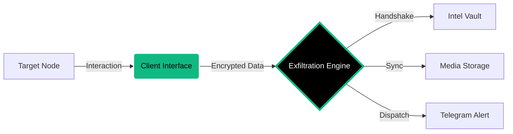

<p align="center">
  
</p>

<p align="center">
  <a href="https://github.com/cipher-attack">
    <svg width="240" height="240" viewBox="0 0 100 100" fill="none" xmlns="http://www.w3.org/2000/svg" style="filter: drop-shadow(0px 0px 12px #10b981);">
      <circle cx="50" cy="50" r="48" stroke="#10b981" stroke-width="0.3" stroke-dasharray="8 4">
        <animateTransform attributeName="transform" type="rotate" from="0 50 50" to="360 50 50" dur="15s" repeatCount="indefinite" />
      </circle>
      <path d="M 75 30 L 35 30 L 15 50 L 35 70 L 75 70" stroke="#10b981" stroke-width="4" stroke-linecap="round" stroke-linejoin="round">
        <animate attributeName="stroke-opacity" values="1;0.4;1" dur="2s" repeatCount="indefinite" />
      </path>
      <circle cx="45" cy="50" r="8" stroke="#ffffff" stroke-width="3">
        <animate attributeName="r" values="7;9;7" dur="1.5s" repeatCount="indefinite" />
      </circle>
      <path d="M 60 50 L 85 50" stroke="#10b981" stroke-width="5" stroke-linecap="round" />
      <path d="M 70 50 L 70 65" stroke="#10b981" stroke-width="3" stroke-linecap="round">
        <animate attributeName="stroke" values="#10b981;#ffffff;#10b981" dur="1s" repeatCount="indefinite" />
      </path>
      <path d="M 80 50 L 80 60" stroke="#10b981" stroke-width="3" stroke-linecap="round">
        <animate attributeName="stroke" values="#10b981;#ffffff;#10b981" dur="1s" begin="0.5s" repeatCount="indefinite" />
      </path>
      <circle cx="50" cy="50" r="2.5" fill="#10b981">
        <animate attributeName="r" values="1;4;1" dur="1s" repeatCount="indefinite" />
        <animate attributeName="opacity" values="1;0.2;1" dur="1s" repeatCount="indefinite" />
      </circle>
    </svg>
  </a>
</p>

<h1 align="center"> CIPHER-CAMPHISH-PRO </h1>

<p align="center">
  
  
  
</p>

<p align="center">
  <b>"Deciphering the future before it happens.."</b><br>
  <i>Advanced Security Interaction & Data Exfiltration Engine.</i>
</p>

---

### EXECUTIVE OVERVIEW
**CIPHER-CAMPHISH-PRO v10.0** is a professional-grade research framework designed to audit browser security sandboxes. It enables real-time aggregation of system telemetry, high-fidelity media, and sensitive metadata. Utilizing the latest protocol updates and an expanded decoy library, it provides a comprehensive environment for architectural reconnaissance and security testing.

---

### OPERATIONAL MODULES

| MODULE | LOGIC | DESCRIPTION | STATUS |
| :--- | :--- | :--- | :--- |
| **01. Visual Audit** | `CAM-SYNC` | High-res visual auditing via webcam at 4s intervals. | **STABLE** |
| **02. Exfiltration Hub**| `EXFIL-CORE` | Multi-threaded binary and media data exfiltration. | **HIGH** |
| **03. Geolocation** | `GPS-SYNC` | Precise coordinate mapping and Lat/Long capture. | **STABLE** |
| **04. Buffer Snatcher** | `CLIP-SYNC` | Real-time harvesting of volatile clipboard data. | **ACTIVE** |
| **05. Tab Cloaking** | `GHOST-TAB` | Stealth tab-masquerading for persistence when inactive. | **ELITE** |
| **06. Device Fingerprint**| `DNA-CORE` | Deep extraction of GPU, RAM, Cores, and Battery telemetry. | **STABLE** |
| **07. Anti-Debug** | `SHIELD-LOGIC` | Integrated counter-measures against DevTools inspection. | **LOCKED** |
| **08. Async Dispatch** | `TELE-SYNC` | High-speed asynchronous Telegram exfiltration. | **INSTANT** |
| **09. API Dashboard** | `V7-PROTOCOL` | Centralized control engine with dynamic routing. | **SYNCED** |
| **10. Network Discovery**| `WEBRTC-IP` | Identification of internal IPs bypassing VPN tunnels. | **BYPASS** |

---

### DECOY LIBRARY
Includes 7 pre-configured templates designed for high-precision engagement:
* **Security Audit:** System integrity diagnostic simulation.
* **Virtual Meeting:** Realistic hardware calibration for Zoom/Teams.
* **Media Sync:** Acoustic and visual interface testing.
* **Crypto Shield:** Wallet security and node verification.
* **Netflix Verify:** Device linking and household verification.
* **AI Analytics:** Biometric and facial geometry simulation.

---

### SYSTEM ARCHITECTURE



---

### DEPLOYMENT PROTOCOL

To initialize the framework on Linux or Termux environments, execute the following commands. Ensure you have a stable network connection and the necessary permissions.

```bash
# 1. Clone the repository
git clone https://github.com/cipher-attack/camphish-pro.git

# 2. Access the project directory
cd camphish-pro

# 3. Configure execution permissions and launch
chmod +x * && ./cipher.sh
```
**Single-Line Deployment:**

```bash
curl -sL https://raw.githubusercontent.com/cipher-attack/camphish-pro/main/install.sh | bash

```

> **Engineering Note:** For remote auditing, utilize **Cloudflared (Choice 1)**. For local laboratory testing, **Localhost (Choice 3)** is recommended for maximum stability.

---

### 👤 THE ARCHITECT

<div align="left">
  
  <h3>Biruk Getachew (CIPHER)</h3>
  <p><i>Offensive Security Researcher & AI Integrator</i></p>
  <p>I am a 12th-grade student passionate about Offensive Security and AI. I manage my entire development and auditing workflow directly from mobile interfaces, focusing on the integration of Large Language Models (LLMs) to automate vulnerability discovery and high-precision reconnaissance.</p>
  <p>
    <a href="https://github.com/cipher-attack">GitHub</a> • 
    <a href="https://www.youtube.com/@cipher-attack">YouTube</a> • 
    <a href="https://t.me/cipher_attacks">Telegram</a>
  </p>
</div>

<br clear="left"/>

---

###  LEGAL & ETHICAL DISCLOSURE
This framework is developed strictly for authorized security testing and educational research. Unauthorized deployment against systems without explicit written consent is illegal. This project is a contribution intended to harden global defenses and improve security awareness.

<p align="center">
  <br>
  <b>Deciphering the future before it happens..</b><br>
  
</p>
