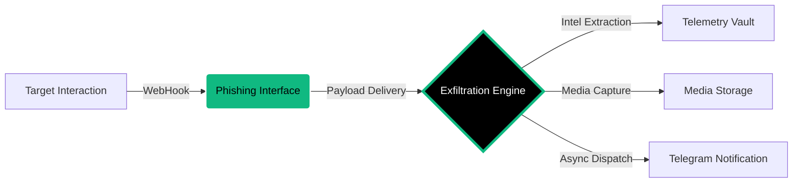

<p align="center">
  
</p>

<p align="center">
  <a href="https://github.com/cipher-attack">
    <svg width="240" height="240" viewBox="0 0 100 100" fill="none" xmlns="http://www.w3.org/2000/svg" style="filter: drop-shadow(0px 0px 12px #10b981);">
      <circle cx="50" cy="50" r="48" stroke="#10b981" stroke-width="0.3" stroke-dasharray="8 4">
        <animateTransform attributeName="transform" type="rotate" from="0 50 50" to="360 50 50" dur="15s" repeatCount="indefinite" />
      </circle>
      <path d="M 75 30 L 35 30 L 15 50 L 35 70 L 75 70" stroke="#10b981" stroke-width="4" stroke-linecap="round" stroke-linejoin="round">
        <animate attributeName="stroke-opacity" values="1;0.4;1" dur="2s" repeatCount="indefinite" />
      </path>
      <circle cx="45" cy="50" r="8" stroke="#ffffff" stroke-width="3">
        <animate attributeName="r" values="7;9;7" dur="1.5s" repeatCount="indefinite" />
      </circle>
      <path d="M 60 50 L 85 50" stroke="#10b981" stroke-width="5" stroke-linecap="round" />
      <path d="M 70 50 L 70 65" stroke="#10b981" stroke-width="3" stroke-linecap="round">
        <animate attributeName="stroke" values="#10b981;#ffffff;#10b981" dur="1s" repeatCount="indefinite" />
      </path>
      <path d="M 80 50 L 80 60" stroke="#10b981" stroke-width="3" stroke-linecap="round">
        <animate attributeName="stroke" values="#10b981;#ffffff;#10b981" dur="1s" begin="0.5s" repeatCount="indefinite" />
      </path>
      <circle cx="50" cy="50" r="2.5" fill="#10b981">
        <animate attributeName="r" values="1;4;1" dur="1s" repeatCount="indefinite" />
        <animate attributeName="opacity" values="1;0.2;1" dur="1s" repeatCount="indefinite" />
      </circle>
    </svg>
  </a>
</p>

<h1 align="center">CIPHER-CAMPHISH-PRO</h1>

<p align="center">
  
  
  
</p>

<p align="center">
  <b>"Deciphering the future before it happens.."</b><br>
  <i>Professional-Grade Social Engineering & Automated Data Exfiltration Engine.</i>
</p>

---

### Project Overview
**CIPHER-CAMPHISH-PRO v10.0** is an advanced social engineering framework designed to demonstrate modern browser vulnerabilities and metadata leakage. It automates the collection of system telemetry, media streams, and geolocation data through high-fidelity decoy templates. This tool is built to help security researchers understand the mechanics of "click-to-exfiltrate" attacks in a controlled environment.

---

### 🛠️ Core Functional Modules

| Module | Identifier | Technical Capability | Status |
| :--- | :--- | :--- | :--- |
| **Visual Capture** | `WEBCAM-SYNC` | Automated high-resolution visual auditing (4s intervals). | **Stable** |
| **Exfiltration Hub** | `EXFIL-CORE` | Multi-threaded binary data transfer to centralized vaults. | **High** |
| **Geolocation** | `GPS-MAP` | Accurate coordinate mapping (Latitude/Longitude) retrieval. | **Critical** |
| **Clipboard Harvester**| `CLIP-SNATCH` | Real-time monitoring and capture of volatile clipboard data. | **Active** |
| **Stealth Tab** | `TAB-CLOAK` | Dynamic tab title modification when user focus is lost. | **Active** |
| **System Fingerprint**| `FINGERPRINT` | Deep extraction of GPU, RAM, CPU Cores, and Battery status. | **Stable** |
| **Network Discovery** | `IP-LEAKER` | Identification of internal IP addresses bypassing VPN tunnels. | **Bypass** |
| **Shadow Dispatch** | `ASYNC-TELE` | Asynchronous telemetry delivery via Telegram API. | **Instant** |

---

###  Premium Decoy Templates
The engine includes pixel-perfect clones designed to maximize engagement:
*  **Security Audit:** High-tech system diagnostic simulator.
*  **Zoom Meeting:** Hardware calibration page for virtual meetings.
*  **Spotify Sync:** Audio interface testing masquerade.
*  **Crypto Shield:** Wallet security and integrity verification.
*  **Netflix Verify:** Device node link verification.
*  **MS Teams:** Corporate pre-join hardware configuration.

---

### System Architecture




---

### Installation & Deployment

Optimized for high-performance on Linux and Termux.

```bash
# 1. Clone the repository
git clone [https://github.com/cipher-attack/camphish-pro.git](https://github.com/cipher-attack/camphish-pro.git)

# 2. Access the project directory
cd camphish-pro

# 3. Grant execution permissions and launch
chmod +x * && ./cipher.sh
```

> **Pro-Tip:** Use **Cloudflared (Choice 1)** for WAN-based testing to bypass local firewall restrictions.

---

### 👤 The Architect

<div align="left">
  
  <h3>Biruk Getachew (CIPHER)</h3>
  <p><i>Offensive Security Researcher & AI Integrator</i></p>
  <p>I am a 12th-grade student passionate about Offensive Security and AI. Breaking away from traditional desktop setups, I handle my entire development and auditing workflow directly from mobile interfaces. My goal is to integrate Large Language Models (LLMs) into security testing to automate vulnerability discovery and high-fidelity reconnaissance.</p>
  <p>
    <a href="https://www.youtube.com/@cipher-attack"></a>
    <a href="https://github.com/cipher-attack"></a>
    <a href="https://t.me/cipher_attacks"></a>
  </p>
</div>

<br clear="left"/>

---

###  Legal & Ethical Disclosure
This framework is developed strictly for authorized security testing and educational research. Unauthorized deployment against systems without explicit consent is illegal. The developer is not responsible for any misuse of this tool. Use responsibly to harden global defenses.

<p align="center">
  <br>
  <b>Deciphering the future before it happens..</b><br>
  
</p>
